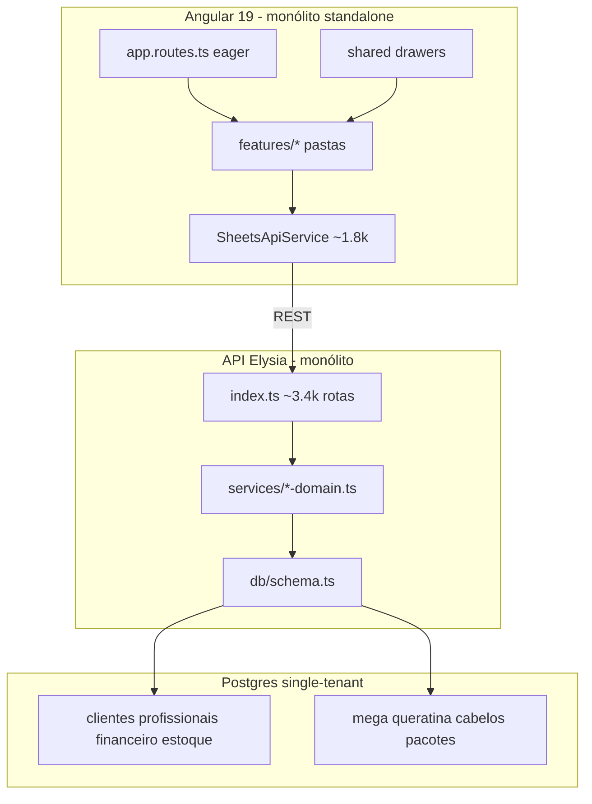
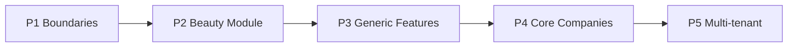

# Relatório de Arquitetura — Nexa Platform

**Escopo:** análise apenas (conforme [Architecture-Analysis.md](docs/05-prompts/Architecture-Analysis.md)). **Nada será implementado até você aprovar.**

**Contexto estratégico:** o código ainda é o ERP **Espaço Lounge** (Beauty / single-tenant). A documentação em `docs/01-product` e `docs/02-architecture` já define a meta **Nexa** (SaaS modular multi-nicho). Gap consciente: *Transitioning from Monolithic to Modular* ([Project-State.md](docs/00-governance/Project-State.md)).

---

## Current Architecture

| Camada | Estado real |
|--------|-------------|
| **Front** | Pastas `core` / `features` / `shared` / `layout`, mas **sem contrato de módulo**: rotas eager em [app.routes.ts](src/app/app.routes.ts), client HTTP único [sheets-api.service.ts](src/app/core/services/sheets-api.service.ts), `shared` importa `features` (inversão). |
| **API** | God router [api/src/index.ts](api/src/index.ts) + services flat (`atendimentos-domain` ~3.5k, `finance-domain` ~2k). WhatsApp já tem boundary limpo em [integrations/whatsapp](api/src/integrations/whatsapp/). |
| **DB** | [schema.ts](api/src/db/schema.ts) single-tenant; dualidade `atendimentos_pedido`/`itens` + tabela `atendimentos` legado planilha; enums/tabelas Beauty no núcleo. |
| **Docs meta** | Core / Shared / Features / Modules ([Architecture.md](docs/02-architecture/Architecture.md), ADR-001). Multi-tenant **adiado** (ADR-002). |

**Mapeamento informal atual → meta Nexa**

| Meta Nexa | Onde está hoje (misturado) |
|-----------|----------------------------|
| Core | Auth JWT, guards, PIN, users/roles, envelope API |
| Shared | Drawers/UI utils — mas poluídos com fluxo de agenda/comanda |
| Features | Agenda, financeiro, CRM, estoque, painel — com regras Beauty dentro |
| Modules (Beauty) | Mega, queratina, cabelo, pacotes, preços por tamanho, comissão de salão |
| Infrastructure | Postgres, Dokploy, Evolution, seed XLSX em `resources/` |

---

## Strengths

- Domínio operacional **rico e em produção** (comanda, pagamentos parciais, caixa, comissões, estoque, booking público).
- Separação física front/API e migrations Drizzle versionadas.
- Integração WhatsApp com **provider interface** (padrão a replicar).
- Documentação Nexa + ADRs já fixam direção (evitar rewrite por nicho).
- Angular standalone + signals modernos; painel já tem layers internas melhores.

---

## Weaknesses

1. **Sem fronteira Module:** Beauty hardcoded em schema, API e UI.
2. **God objects:** `index.ts`, `atendimentos-domain`, `SheetsApiService`, `api.models.ts`.
3. **Dependência invertida:** `shared` → `features/agenda` (ex.: drawers globais).
4. **Rotas/API não fatiadas:** sem lazy load / sem plugins Elysia por domínio.
5. **Modelo de dados híbrido** (pedido estruturado + linhas texto estilo planilha); dinheiro muitas vezes em `text`.
6. **`ensureSchemaPatches`** como segunda fonte de verdade ao lado de `drizzle/`.
7. **Single-tenant + roles grosseiros** (admin/profissional); pouco isolamento por profissional.
8. **Seed/ETL acoplados** ao XLSX Espaço Lounge — onboarding de outro negócio = reescrever import.
9. **Docs Nexa ≠ README/código** (marca e pastas ainda “Espaço Lounge” em vários pontos).

---

## Improvement Opportunities

- Extrair **Features genéricas** (Scheduling, CRM, Finance, Inventory) sem tipos `mega`/`cabelo`.
- Isolar **Module Beauty** (catálogo especial + regras de item + UI de pacotes).
- Split do client HTTP e do router API **por domínio** (mesmo monólito deployável).
- Corrigir grafo de dependências: Shared nunca importa Features/Modules.
- Lazy routes por feature (ganho imediato de bootstrap).
- Unificar modelo de atendimento (deprecar dual-write legado com plano).
- Padronizar dinheiro como `numeric` e timezone/helpers já existentes em `lib/`.

---

## Migration Suggestions

**Princípio (ADR-001/005):** extrair e isolar sem big-bang; multi-tenant só depois do Core estável.

### P1 — Boundaries (baixo risco, alto valor)
- API: fatiar [index.ts](api/src/index.ts) em plugins Elysia (`auth`, `crm`, `scheduling`, `finance`, `inventory`, `beauty`, `whatsapp`).
- Front: `*.routes.ts` por feature + `loadComponent`; começar a fatiar `SheetsApiService` em clients por domínio (manter facade temporária).
- Corrigir imports: mover `saas-select` e contratos de drawer para Shared/Features sem depender de `agenda/novo`.

### P2 — Module Beauty explícito
- Pastas alvo (alinhadas à doc): `modules/beauty` (front) e `api/src/modules/beauty` (services + rotas de mega/queratina/cabelo/pacotes).
- Manter tabelas Beauty, mas **só o módulo Beauty** as conhece; Features falam via tipos genéricos de item (`service` / `product` / `package` extensível).
- UI de comanda: estratégias de linha de item registradas pelo módulo (plugin), não `if tipo === 'mega'` espalhado.

### P3 — Features genéricas
- Renomear/reorganizar mentalmente: agenda → Scheduling, clientes → CRM, etc., sem lógica de tamanho de cabelo.
- Contratos estáveis de API envelope já existentes.

### P4 — Core (Companies / Settings)
- Introduzir entidades Core documentadas (company/settings) **ainda single-tenant** (uma company implícita = Espaço Lounge), preparando FK futura.

### P5 — Multi-tenant (ADR-002)
- Shared DB + `company_id` — **somente após** P1–P4. Fora do horizonte imediato.

**Fora de escopo agora:** novos nichos (Sports/Clinic), multi-repo, reescrever financeiro.

---

## Risks

| Risco | Impacto |
|-------|---------|
| Refator “bonita” paralela ao go-live do salão | Regressão em comanda/caixa/comissões |
| Extrair Beauty cedo demais sem testes | Quebra de pacotes/mega no fluxo diário |
| Multi-tenant prematuro | Custo alto, pouco retorno enquanto há 1 cliente |
| Dois schemas da verdade (patches + migrations) | Drift em deploys Dokploy |
| Renomear tudo “Nexa” no código de uma vez | Ruído em PRs sem ganho estrutural |

**Mitigação:** fatias verticais pequenas, feature branch, validar fluxos críticos (nova comanda → faturar → caixa → comissão).

---

## Recommended Priorities

Ordem sugerida após aprovação (primeira implementação concreta = **só P1**):

1. **P1 Boundaries** — split API plugins + lazy routes + início do split do `SheetsApiService` + corrigir Shared→Feature.
2. **P2 Beauty Module** — isolar mega/queratina/cabelo/pacotes atrás de boundary de módulo.
3. **P3** endurecer Features genéricas e limpar dual-write onde for seguro.
4. **P4** company/settings no Core (single-tenant).
5. **P5** multi-tenant quando houver 2º cliente/nicho real.

---

## Aguardo sua aprovação

Nenhuma alteração de código será feita até você confirmar.

**Proposta ao aprovar:** iniciar **apenas P1** (boundaries), sem multi-tenant e sem criar Sports/Clinic. Se quiser outro recorte (ex.: pular direto para P2 Beauty), diga na aprovação.
