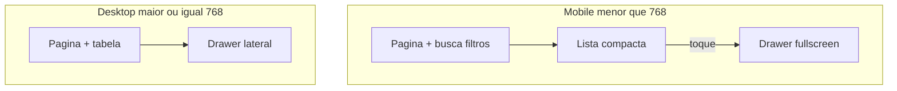

# Phase 2 — Mobile Entity Pattern

## Checkpoint Git

- **Branch:** `phase2/mobile-foundation`
- **Working tree:** limpa
- Sem checkout / reset / stash / commit / push neste plano

**Fora deste plano:** correção Sidebar 768–1999 / ≥2000 (tratada separadamente). Não misturar.

**Breakpoints:** manter `shell-mobile` (768). Não alterar [`breakpoints.ts`](src/app/styles/breakpoints.ts) / [`_breakpoints.scss`](src/app/styles/_breakpoints.scss) para este padrão. Não usar 640px para tabela vs lista.

---

## 1. Diagnóstico da estratégia atual

A fundação responsiva compartilhada (drawers column/scroll, table-wrap `overflow-x: auto`, alinhamento 640→768 em casos pontuais) melhorou infraestrutura, mas **não resolve UX** em listagens densas.

| Estratégia | Resultado no QA |
|------------|-----------------|
| `overflow-x: auto` em tabelas 8–12 cols | Tecnicamente acessível; operação ruim em 390–767 |
| Mesma tabela em todo viewport | Densidade inadequada para mobile |
| Cards pesados tipo dashboard | Não desejado |

**Conclusão:** para entidades densas com drawer de detalhe, a apresentação mobile deve mudar — não só o overflow.

---

## 2. Justificativa — Mobile Entity Pattern

Padrão de produto do Nexa para listagens densas:



**Princípios**

- Mesma entidade, dados, services e regras — só muda a apresentação
- Item mobile mostra **só o essencial** para identificar o registro (não todas as colunas)
- Detalhe + ações no drawer (ou menu que chama as mesmas operações)
- Visual = **list item** compacto, não card de dashboard
- Não aplicar a toda tela indiscriminadamente

---

## 3. Mapeamento A / B / C / D (+ E)

| Tela | Classe | Densidade | Drawer | Detalhe | Bulk | Adaptação |
|------|--------|-----------|--------|---------|------|-----------|
| **Clientes** | **B** (1º caso) | Alta (muitas cols toggle) | `ClienteCadastroDrawerService` | Nome→Painel; lápis→Cadastro | Checkboxes sem ação em massa | Lista local + tap → drawer |
| **Profissionais** | **B** (2º/3º) | Média (~5 cols) | `ProfissionalCadastroDrawerService` | Nome/editar→drawer | Não | Lista simples; inativar no drawer/modal existente |
| **Fornecedores** | **B** (depois) | Similar marcas/profs | Drawer cadastro | Sim | Verificar | Mesmo padrão B |
| **Produtos** | **B** (2º/3º) | Alta (~8 cols) | `ProdutoCadastroDrawerService` + mov. | Nome/editar; estoque→mov | UI sem ações em massa | Lista; omitir bulk mobile |
| **Serviços** | **B** (depois) | Alta (~8) | `ServicoCadastroDrawerService` | Sim | Verificar | Após Produtos |
| **Comandas** | **B** (depois) | Alta (~8–9) | Nova comanda / faturar | Sim | Verificar | Drawer wide já full-bleed |
| **Orçamentos** | **B** (depois) | Média–alta (~7) | Drawer agenda-novo | Sim | Verificar | Após Clientes |
| **Transações** | **B** (depois) | Muito alta (~11) | Novo/editar/comanda | Sim | Verificar | Alta prioridade após core cadastros |
| **Comissões** | **C** | — | Pagar + comanda | Já cards `shell-mobile` | Seleção nos cards | Não converter para padrão genérico |
| **Categorias** | **A** | Baixa (~4) | Cadastro | Sim | Pouco uso | Tabela + scroll |
| **Marcas** | **A** | Baixa (~4) | Cadastro | Sim | Pouco uso | Tabela + scroll |
| **Agenda Lista** | **C** | Baixa | Não (só leitura) | Cards próprios | Não | Manter |
| **Agenda Grelha** | **D** | — | Drawers próprios | Grade/pan/drag | — | **Não** converter |

**E (exceções / não listagem de entidade):** Painel, dashboards, formulários standalone, Configurações/WhatsApp — **D**.

---

## 4. Análise detalhada — Clientes

| Aspecto | Estado |
|---------|--------|
| Desktop | Tabela madura; cols toggle + localStorage |
| Mobile hoje | Mesma tabela; página força `overflow: visible` no wrap |
| Dados | `listClientes()` + mapa débitos; tipo `Cliente` |
| Abrir detalhe | `abrirEdicao(id, { abaInicial: 'Painel' \| 'Cadastro' })` |
| Novo | `abrirNovo` |
| Bulk | Checkboxes sem bulk actions → **omitir no mobile** |
| Item mobile proposto | Avatar + nome + celular/telefone + chevron |
| Tap | Mesmo `abrirPerfilCliente` / Painel |
| Excluir / editar Cadastro | Dentro do drawer (e/ou ícone secundário chamando handlers existentes) |

---

## 5. Análise detalhada — Profissionais

| Aspecto | Estado |
|---------|--------|
| Colunas | Ordem, Nome+avatar, Celular, E-mail, Ações |
| Drawer | Já `width: 100vw` em `agenda-mobile` (≤768) |
| Bulk | Não |
| Mobile hoje | Só tabela + scroll shell |
| Ações | Novo, Ativos/Inativos, reorder, editar, inativar |
| Item mobile | Avatar + nome (+ badge Admin) + celular |
| Reorder | Manter só no desktop nesta fase (drag na tabela) |
| Classe | **B** — implementar **após** Clientes (e idealmente junto/após Produtos para validar shared) |

---

## 6. Análise detalhada — Produtos (Estoque)

| Aspecto | Estado |
|---------|--------|
| Colunas | Check, Nome, Marca, Categoria, Estoque, Preço, Comissão, Ações |
| Drawer cadastro | `min(1024px, 100vw)` → full width no mobile |
| Extra | Drawer movimentações estoque |
| Bulk | UI sem ações → **omitir no mobile** |
| Item mobile | Nome + marca ou estoque/preço (1 linha secundária) |
| Tap | `abrirEdicao` cadastro; estoque pode permanecer ação no drawer ou subtítulo |
| Classe | **B** — 2º candidato após Clientes |

---

## 7–8. Proposta — Mobile Entity List / List Item

### Nesta etapa (Clientes): implementação **local**

Não criar `MobileEntityList` / `MobileEntityListItem` shared ainda.

**Markup local** (conceito):

```html
<!-- só bp-down(shell-mobile) -->
<button type="button" class="clientes-mobile-item" (click)="abrirPerfilCliente(c)">
  <app-cliente-avatar ... />
  <span class="clientes-mobile-item__text">
    <span class="clientes-mobile-item__title">{{ c.nome }}</span>
    <span class="clientes-mobile-item__sub">{{ c.celular || c.telefone }}</span>
  </span>
  <span class="clientes-mobile-item__chevron" aria-hidden="true">›</span>
</button>
```

Estilo: linha compacta, borda leve ou divider, hit target ≥44px, sem sombra multi-layer / pills.

### Contrato futuro (quando extrair)

| Peça | Responsabilidade |
|------|------------------|
| List | Container; esconde tabela / mostra itens em `shell-mobile` |
| ListItem | slot/inputs: leading (avatar), title, subtitle?, trailing chevron; `click` |

**Quando extrair:** depois que **Clientes + Produtos + Profissionais** estiverem estáveis e o markup/CSS coincidir ≥80%. Até lá, copiar com disciplina.

Referências visuais internas (não shared): Comissões cards, Agenda Lista cards — mais densos; Nexa prefere list item mais leve.

---

## 9. Estratégia — drawer fullscreen

Preferência em `<768`: `width: 100%` / `100vw` + `height: 100dvh` (já reforçado por `drawer-mobile-column`).

| Drawer | Já full width mobile? |
|--------|------------------------|
| Cliente | `min(shell-w, 100vw)` — validar; se sobrar gap, forçar `100vw` em `shell-mobile` |
| Profissional | Sim (`100vw` explícito) |
| Produto | Sim (`min(1024, 100vw)`) |

**Clientes nesta etapa:** validar host; se não estiver full-bleed, ajuste mínimo só no SCSS do host cliente (sem redesign).

Nav interna: manter grade superior existente (`ficha-stack` 860); não redesenhar abas. Prioridade = usabilidade + scroll body + footer CTA.

---

## 10. Estratégia de ações

- Desktop: ações atuais intactas
- Mobile: detalhe/ações **no drawer** (mesmos services/handlers)
- Não duplicar excluir/inativar/salvar só para mobile
- Ícones na linha mobile: só se necessário; preferir tap → drawer

---

## 11. Estratégia de seleção

- Desktop checkboxes: manter
- Mobile Clientes/Produtos: **omitir** seleção em massa (sem bulk actions reais)
- Comissões: mantém seleção nos cards (padrão C próprio)

---

## 12–14. Reutilização vs componentes novos

**Reutilizar agora**

- `list-page-shell` (toolbar/busca)
- `ClienteCadastroDrawerService` + host
- `Cliente` model + `listClientes`
- Avatar existente
- Switch tabela/lista como em Comissões (`bp-down(shell-mobile)`), sem copiar visual de card pesado

**Novo nesta etapa**

- Bloco HTML/SCSS **local** da lista mobile em Clientes
- Ajuste fullscreen do drawer cliente **somente se** QA/código mostrar gap

**Shared depois:** `MobileEntityListItem` — pós 2–3 casos B

---

## 15. Arquivos — implementação Clientes (após aprovação)

| Arquivo | Mudança |
|---------|---------|
| [`clientes.component.html`](src/app/features/clientes/pages/lista/clientes.component.html) | Lista mobile + ocultar tabela em mobile |
| [`clientes.component.scss`](src/app/features/clientes/pages/lista/clientes.component.scss) | Estilos list item; corrigir overflow wrap vs shell |
| [`clientes.component.ts`](src/app/features/clientes/pages/lista/clientes.component.ts) | Só se precisar helper de subtítulo/telefone |
| [`cliente-cadastro-drawer-host.component.scss`](src/app/shared/cliente-cadastro-drawer/cliente-cadastro-drawer-host.component.scss) | Fullscreen `shell-mobile` se necessário |

**Não alterar:** API, Agenda grelha, Sidebar, outras features B, breakpoints oficiais.

---

## 16. Riscos de regressão

| Risco | Mitigação |
|-------|-----------|
| Tabela some no desktop | MQ estrita `bp-down(shell-mobile)` |
| Duplo scroll / layout | Um body scroll no drawer; lista na página |
| Perda de excluir no mobile | Ação no drawer/modal existente |
| Paginação/filtros | Compartilhados; validar com lista |
| Budgets SCSS clientes | Aumento pequeno esperado |

---

## 17. Validação

| Viewport | Esperado |
|----------|----------|
| 390 / 640 / 767 | Lista compacta; tap → drawer ~fullscreen; abas/footer ok |
| 768 / 1024+ | Tabela; drawer lateral; sem lista mobile |
| Busca / filtros / Novo / paginação | Funcionam nos dois modos |
| Builds | `ng build --configuration=development`; `npm run build`; `git diff --check` |

---

## 18. Build / budgets

- Só FE/SCSS — budgets conhecidos podem subir levemente em `clientes` / drawer host
- Não alterar `angular.json`
- Registrar deltas vs estado pré-mudança

---

## Ordem após aprovação

1. Clientes — lista mobile local + drawer fullscreen se preciso  
2. Validação + builds (sem commit até pedido)  
3. Etapa seguinte: Produtos → Profissionais  
4. Só então avaliar extração `MobileEntityListItem`  
5. Demais B (Comandas, Orçamentos, Transações, Serviços, Fornecedores) em rodadas próprias  

## Explicitamente fora

Sidebar architecture, Agenda Grelha, Impeccable, API/BD, Features D, Configurações, redesign completo, shared genérico prematuro.
