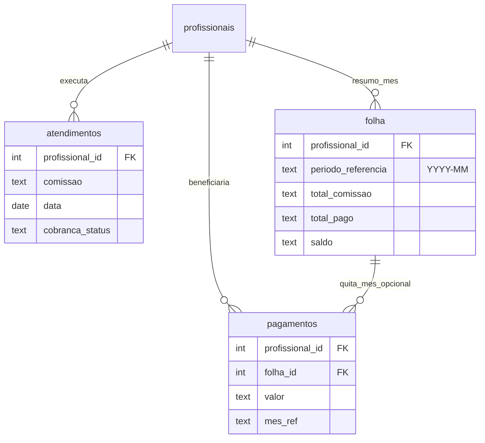

# Comissões: `atendimentos`, `folha` e `pagamentos`

## Papéis

| Tabela | Papel |
|--------|--------|
| **`atendimentos`** | Fonte de verdade **por linha de serviço**: `profissional_id` (quem executou), `valor`, `comissao` (texto já normalizado para BD), `data`, `cobranca_status` / `pagamento_status` (ciclo de cobrança **do cliente**). A comissão da profissional nasce aqui quando o pedido é montado (catálogo / regras Mega). |
| **`folha`** | **Resumo mensal por profissional** (legado da planilha “Folha”): totais esperados ou consolidados (`total_comissao`, `total_pago`, `saldo`, `status`). Deve alinhar-se logicamente com a **soma das comissões** em `atendimentos` do mesmo `profissional_id` e **competência** (mês civil da `data`). O campo `periodo_referencia` (`YYYY-MM`) liga explicitamente a linha da folha ao mês. |
| **`pagamentos`** | **Pagamento à profissional** (saída do salão): cada registo é um pagamento efetuado (valor, data, tipo, observação). `profissional_id` identifica a beneficiária; `folha_id` (opcional) associa o pagamento à **linha de folha** do mês que está a ser quitado. `mes_ref` mantém-se como texto legado compatível com a planilha. |

## Fluxo de dados

1. **Gerar comissão**: ao criar/finalizar linhas em `atendimentos`, preenche-se `comissao` (regra do serviço / Mega / Pacote).
2. **Conferir / fechar mês na folha**: agregação por `profissional_id` + `periodo_referencia` (derivado de `atendimentos.data`), comparando com `folha.total_comissao` (pode ser recalculada por job ou API).
3. **Pagar profissional**: inserir linha em `pagamentos` com `valor`, `profissional_id`, opcionalmente `folha_id`; atualizar `folha.total_pago` / `saldo` conforme o processo interno.

## Relacionamento lógico (sem FK em `atendimentos`)

Não é obrigatório FK de `atendimentos` → `folha`: a competência é `(profissional_id, date_trunc('month', data))`. A folha é um **agregado** (e eventualmente cache) desse conjunto.

## Exemplo de agregação (referência SQL)

```sql
-- Comissões por profissional e mês (valores ainda em texto; normalização numérica na aplicação)
SELECT
  a.profissional_id,
  to_char(date_trunc('month', a.data::timestamp), 'YYYY-MM') AS competencia,
  COUNT(*) AS linhas,
  SUM(length(trim(coalesce(a.comissao, '')))) AS tem_comissao_preenchida
FROM atendimentos a
WHERE a.profissional_id IS NOT NULL
  AND a.data IS NOT NULL
  AND lower(coalesce(a.cobranca_status, '')) = 'finalizada'
GROUP BY 1, 2;
```

(Um passo seguinte típico é coluna `comissao_valor numeric` ou view materializada com parse em PT-BR.)

## Diagrama



## Recálculo via API

`POST /api/folha/recalcular-comissoes`

Corpo JSON:

- `periodo` (obrigatório): `YYYY-MM` (ex.: `2026-04`).
- `profissional_id` (opcional): limita atendimentos e linhas de folha a essa profissional.

Comportamento: soma `comissao` das linhas de `atendimentos` com `cobranca_status = finalizada`, `profissional_id` definido e `data` no mês; atualiza `folha.total_comissao` nas linhas cuja `periodo_referencia` coincide. Se `total_pago` for legível como valor, atualiza também `saldo` (comissão − pago).

## Próximos passos sugeridos

- Botão na UI de folha que chame este endpoint.
- Tipo `numeric` para totais e valores de pagamento (migração gradual a partir de `text`).
- Tabela de **auditoria** `folha_historico` se precisarem de rastrear alterações manuais na folha.
