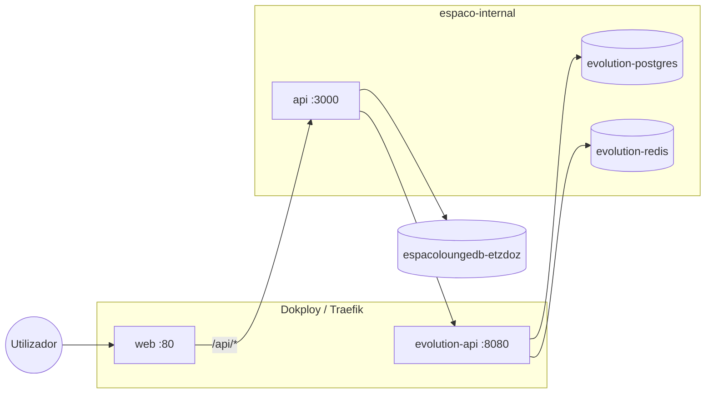

# Deploy no Dokploy — Espaço Lounge

Stack Docker Compose com **todas as camadas**: Postgres (ERP), API Elysia, front Angular (nginx) e Evolution API (WhatsApp).

Ficheiro principal: [`docker-compose.dokploy.yml`](../docker-compose.dokploy.yml)

## Arquitetura



| Serviço | Função | Expor no Dokploy |
|---------|--------|------------------|
| `web` | Angular estático + proxy `/api` → API | **Sim** — domínio principal |
| `api` | API Elysia + migrações no arranque | Não (rede interna + dokploy-network) |
| Postgres Dokploy | `espacoloungedb-etzdoz` (fora deste compose) | Serviço Database no projeto |
| `evolution-api` | WhatsApp (Baileys) | **Opcional** — subdomínio para QR/Manager |
| `evolution-postgres` / `evolution-redis` | Dados da Evolution | Não |
| `evolution-manager` | UI web da Evolution | Perfil `manager` (opcional) |

## Passo a passo no Dokploy

1. **Projeto** → criar projeto (ex. `espaco-lounge`).
2. **Compose** → tipo *Docker Compose* (não Stack/Swarm).
3. **Git** → ligar este repositório e branch (`main` ou `feature/...`).
4. **Compose path** → `docker-compose.dokploy.yml`
5. **Environment** → copiar variáveis de [`.env.dokploy.example`](../.env.dokploy.example) e preencher segredos.
6. **Domains** (recomendado):
   - Serviço `web` → `app.seudominio.com.br` (HTTPS automático)
   - Serviço `evolution-api` → `evolution.seudominio.com.br` (se precisar de QR code / webhooks públicos)
7. **Deploy** → o Dokploy executa `docker compose up -d --build`.

### DNS

Crie registos **A** (ou CNAME) apontando para o IP do servidor Dokploy:

- `app.seudominio.com.br`
- `evolution.seudominio.com.br` (opcional)

## Variáveis obrigatórias

| Variável | Descrição |
|----------|-----------|
| `POSTGRES_PASSWORD` | Senha do Postgres do ERP |
| `JWT_SECRET` | Segredo JWT (longo, aleatório) |
| `EVOLUTION_POSTGRES_PASSWORD` | Senha do Postgres da Evolution |
| `EVOLUTION_API_KEY` | Chave `apikey` da Evolution (igual em Configurações → WhatsApp) |
| `EVOLUTION_SERVER_URL` | URL pública da Evolution (`https://evolution...`) |

Recomendadas: `ADMIN_EMAIL`, `ADMIN_PASSWORD`, `CORS_ORIGINS`, `ADMIN_PIN`.

### Rede e Postgres (API)

O Postgres do ERP é o **serviço Dokploy** (não um container neste compose):

| Campo | Valor |
|-------|--------|
| Host | `espacoloungedb-etzdoz` (`DB_HOST`) |
| User / DB | `espacolounge` / `espacolounge` |
| Senha | `POSTGRES_PASSWORD` (a mesma do serviço Postgres no Dokploy) |

A API tem de estar na **`dokploy-network`** para resolver esse hostname.

| Rede | Função |
|------|--------|
| `dokploy-network` | Traefik + Postgres Dokploy (`espacoloungedb-etzdoz`) |
| `espaco-internal` | DNS entre `api`, `web` e Evolution |

Não é preciso `DATABASE_URL` — o entrypoint monta a URL a partir de `DB_HOST` + `POSTGRES_PASSWORD`.

#### Erro nginx: `host not found in upstream "api"`

O front (nginx) faz proxy de `/api` e `/health` para o serviço `api`. Com `proxy_pass` estático o nginx resolve o host **no arranque** e aborta se a API ainda não estiver no DNS.

O `deploy/nginx.conf` usa o DNS do Docker (`127.0.0.11`) e resolve em cada pedido; o compose só sobe o `web` depois da API healthy.

1. Redeploy com esta correção (rebuild da imagem `web`).
2. Confirme que o serviço `api` está **Running** / healthy.
3. Se o DNS `api` continuar inacessível no Dokploy → Environment:
   ```text
   API_HOST=espaco-lounge-api
   ```
   ou o **nome real** do container da API (menu Docker), como em `DB_HOST`.

## Pós-deploy

1. **Health** — `https://app.seudominio.com.br/health` deve responder JSON.
2. **Login** — `https://app.seudominio.com.br/login` com `ADMIN_EMAIL` (criado se `usuarios` estiver vazio).
3. **WhatsApp** — em Configurações → WhatsApp:
   - URL: `EVOLUTION_SERVER_URL`
   - API Key: `EVOLUTION_API_KEY`
   - Criar instância (ex. `espaco-lounge`) e ler QR no Manager ou painel Evolution.
4. **Agendamento público** — `https://app.seudominio.com.br/agendar`

## Migrações e seed

- **Migrações**: aplicadas automaticamente no arranque da API (`RUN_MIGRATIONS=true`, default).
- **Seed** (só dev/cutover): entrar no terminal do serviço `api` no Dokploy e executar `npm run db:seed` (apaga dados das tabelas do seed).

## Evolution Manager (UI opcional)

Para subir a UI web da Evolution, use perfil Compose no comando avançado do Dokploy:

```bash
compose -p <projeto> -f docker-compose.dokploy.yml --profile manager up -d --build
```

Ou adicione domínio ao serviço `evolution-manager` na aba Domains.

## Volumes e backups

O compose usa **named volumes** (`espaco_lounge_pg`, `evolution_postgres`, etc.) — compatíveis com *Volume Backups* do Dokploy.

## Desenvolvimento local (testar a stack)

```bash
cp .env.dokploy.example .env
# Edite .env com senhas locais

docker compose -f docker-compose.dokploy.yml --env-file .env up -d --build
```

Front em `http://localhost` (mapeie porta no compose se quiser testar sem Dokploy) ou use `docker compose ... port` temporariamente.

## Ficheiros Docker

| Ficheiro | Camada |
|----------|--------|
| [`Dockerfile`](../Dockerfile) | Front Angular → nginx |
| [`deploy/nginx.conf`](../deploy/nginx.conf) | SPA + proxy `/api` |
| [`api/Dockerfile`](../api/Dockerfile) | API Node + entrypoint |
| [`api/docker-entrypoint.sh`](../api/docker-entrypoint.sh) | `db:migrate` + `npm start` |
| [`src/environments/environment.docker.ts`](../src/environments/environment.docker.ts) | `apiBaseUrl: ''` (mesmo host) |

## Alternativa: API em subdomínio

Se preferir `api.seudominio.com.br` em vez do proxy nginx:

1. Adicione domínio ao serviço `api` no Dokploy.
2. Altere `src/environments/environment.production.ts` com `apiBaseUrl: 'https://api.seudominio.com.br'`.
3. Ajuste `CORS_ORIGINS` com a URL do front.
4. Use build `production` no `Dockerfile` do front (ou variável de build).

O layout default (um domínio + proxy) é o mais simples para o salão.
